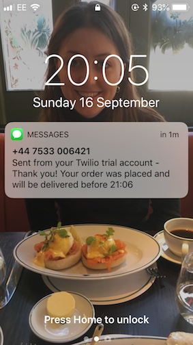
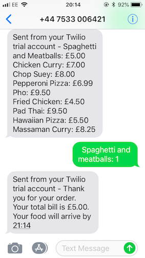

Takeaway Challenge
[](https://travis-ci.com/camjw/takeaway-challenge)

[](https://codecov.io/gh/camjw/takeaway-challenge)

==================
```
                            _________
              r==           |       |
           _  //            |  M.A. |   ))))
          |_)//(''''':      |       |
            //  \_____:_____.-------D     )))))
           //   | ===  |   /        \
       .:'//.   \ \=|   \ /  .:'':./    )))))
      :' // ':   \ \ ''..'--:'-.. ':
      '. '' .'    \:.....:--'.-'' .'
       ':..:'                ':..:'

 ```

This project is a ruby implementation of the following four user stories:

```
As a customer
So that I can check if I want to order something
I would like to see a list of dishes with prices

As a customer
So that I can order the meal I want
I would like to be able to select some number of several available dishes

As a customer
So that I can verify that my order is correct
I would like to check that the total I have been given matches the sum of the various dishes in my order

As a customer
So that I am reassured that my order will be delivered on time
I would like to receive a text such as "Thank you! Your order was placed and will be delivered before 18:52" after I have ordered
```

The behaviour in these user stories is captured in the `Restaurant` class, which the customer should interact with. There is also a `Menu` class which controls the Menu the customer can choose from. This class should be used by the Restaurant manager. Finally, the `Restaurant` instructs the `OrderConfirmer` to send a confirmation text to the customer. The `OrderConfirmer` uses a RESTful API by Twilio and so the confirmation text is always sent to my personal number since I'm using the free version of Twilio.

Additionally, a fifth user story is implemented in this repository:

```
As a customer
So that I can place an order when I'm not at my computer
I would like to be able to order food from the restaurant via SMS.
```
This is done in the `SMSReceiver` class and the Sinatra site `sms_receiver_app`.

# Usage

## Requirements

A full Gemfile is included but three which were particularly useful are:

``` ruby
gem 'shotgun'
gem "sinatra"
gem 'twilio-ruby'
```

The `twilio-ruby` gem was used to interface with Twilio, who provide the SMS API used in this project. Next, `shotgun` was used to run the `sinatra` app locally.

Finally, a service called [ngrok](https://ngrok.com/) was used to expose my local host. This was necessary for testing the `sms_receiver_app` and was especially helpful for debugging.

## Setup

To install the repository's dependencies simply run
```
bundle install
```

There are 20 tests to run, all of which are `rspec` tests. They are all passing and give 100% coverage of the code base. To run the tests simply run in the terminal:
```
rspec
```

The code has been linted with `rubocop` and `rubycritic`. The code scores 90.47 on `rubycritic`.


## Examples

### Restaurant example

We're only going to show how the `Restaurant` class behaves, which is the only class the Customer should directly interact with.

```ruby
require 'restaurant'

# We can make a new restaurant easily
sophies_caf = Restaurant.new

# This restaurant has the default menu which can be accessed from the Menu class as the constant Menu::DEFAULT_MENU.
sophies_caf.display_menu
# => Spaghetti and Meatballs: £5.00
# Chicken Curry: £7.00
# Chop Suey: £8.00
# Pepperoni Pizza: £6.99
# Pho: £9.50
# Fried Chicken: £4.50
# Pad Thai: £9.50
# Hawaiian Pizza: £5.50

# To add items to the basket we use the add_to_basket method.
sophies_caf.add_to_basket("Spaghetti and Meatballs")
sophies_caf.display_basket
# => Spaghetti and Meatballs x 1 = £5.00

# add_to_basket takes an option second parameter indicating the number of times the item should be added.
# The add_to_basket method will also raise an error if we try to add an item which is not on the menu.

# Finally, we can checkout by supplying the total price of our order:
sophies_caf.checkout(5)
# => You will shortly receive a text confirming your order
```

At the end of this example the `order_confirmer` will send the user a text confirming their order:




### SMSReceiver example

The customer can also order food by texting the Restaurant. This is achieved by the `SMSReceiver` class and the `sms_receiver_app`, which uses Twilio and an HTTP GET webhook to send all texts to an ngrok website which is hosting our localhost. Then, a sinatra web app responds to text messages, as shown:


Obviously, the only thing to order is Spaghetti and Meatballs.



The customer is told their total bill and the time they can expect their food by.
